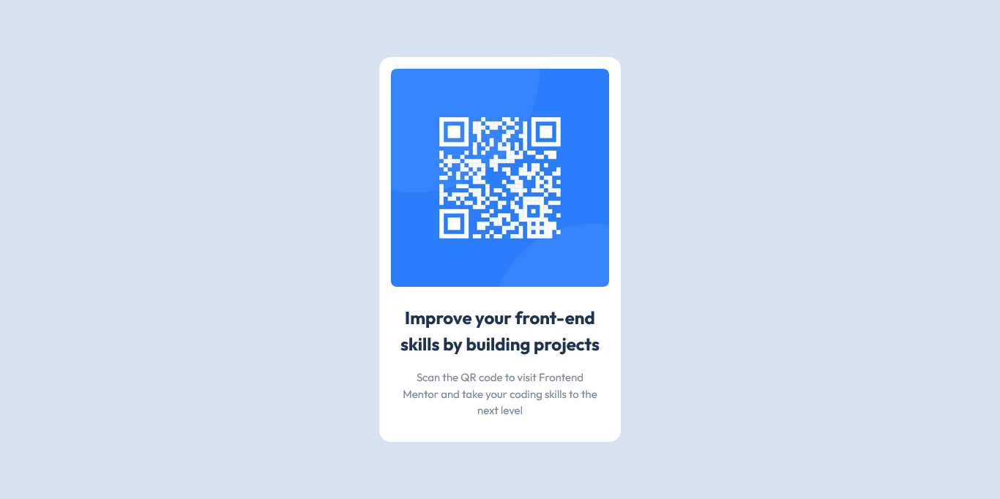

# Frontend Mentor - QR code component solution

This is a solution to the [QR code component challenge on Frontend Mentor](https://www.frontendmentor.io/challenges/qr-code-component-iux_sIO_H). Frontend Mentor challenges help you improve your coding skills by building realistic projects. 

## Table of contents

- [Overview](#overview)
  - [Screenshot](#screenshot)
  - [Links](#links)
- [My process](#my-process)
  - [Built with](#built-with)
  - [What I learned](#what-i-learned)
- [Author](#author)

## Overview

### Screenshot




### Links

- Solution URL: [Github](https://github.com/loifloro/qr-code-component)
- Live Site URL: [Github Pages](https://loifloro.github.io/qr-code-component/dist/)

## My process

### Built with

- Semantic HTML5 markup
- CSS custom properties
- Mobile-first workflow
- CSS Grid
- SCSS
- BEM Methodology


### What I learned

I learned in this activity how to properly center a div using grid and place-items: center. 

```css
body {
    background: $light-gray;
    font-family: Outfit, sans-serif;
    height: 100vh;
    display: grid;
    place-items: center;
}
.card {
    background: $white;
    max-width: 330px;
    border-radius: 1rem;
    padding: 1rem;
    margin: auto;
}
```


## Author

- Github - [loifloro](https://github.com/loifloro/)
- Frontend Mentor - [@loifloro](https://www.frontendmentor.io/profile/loifloro)
- Twitter - [@loisfloro](https://www.twitter.com/yourusername)

## Acknowledgments

Thanks to Frontend Mentor community for always giving feedback to newbie users like me. 